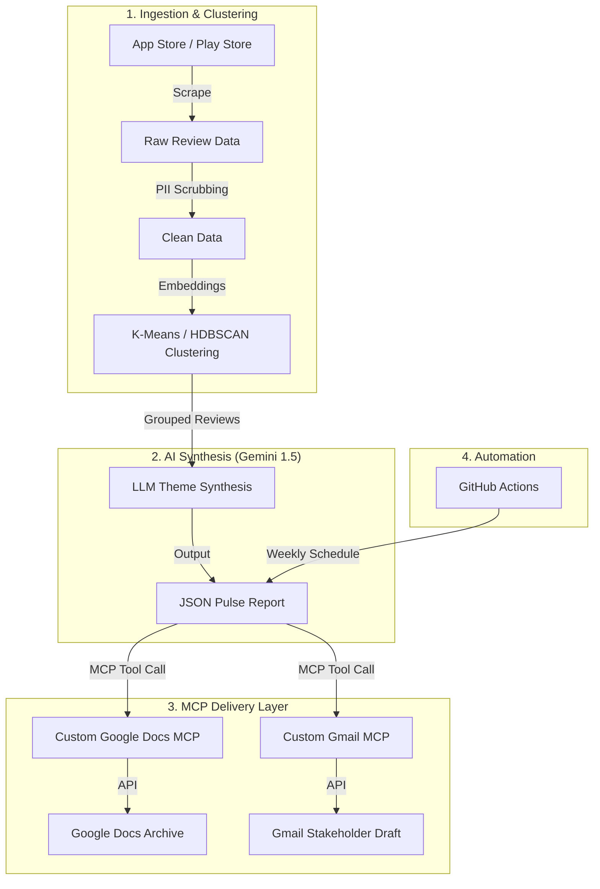

# 🚀 Weekly Product Review Pulse

**An AI-Native Agentic Workflow for Automated Product Intelligence.**

The **Weekly Product Review Pulse** is an automated pipeline that transforms thousands of raw App Store and Play Store reviews into actionable, stakeholder-ready insights. By leveraging clustering algorithms, Large Language Models (LLMs), and the **Model Context Protocol (MCP)**, it automates the entire journey from data ingestion to Google Workspace delivery.

---

## 🏗️ Architecture Overview

The system follows a modular **Agentic design**, separating the "reasoning" (AI Orchestrator) from the "actions" (MCP Servers).



---

## ✨ Key Features

- **🧠 Intelligent Synthesis**: Uses **Google Gemini** to analyze review clusters, extracting verbatim customer quotes and generating prioritized action items.
- **🔌 Model Context Protocol (MCP)**: Implements custom MCP servers to provide the AI Agent with secure, standardized access to the Google Workspace ecosystem.
- **📊 Semantic Clustering**: Utilizes `sentence-transformers` and clustering algorithms to identify emerging trends across 10,000+ reviews without manual tagging.
- **📧 Premium Reporting**: Generates mobile-responsive HTML email drafts with deep links to a Master Google Doc archive.
- **🤖 Serverless Automation**: Fully managed via **GitHub Actions**, delivering insights every Monday at 8:00 AM IST.

---

## 🛠️ Technology Stack

| Layer | Technology |
| :--- | :--- |
| **LLM** | Google Gemini 1.5 Flash / Pro |
| **Integrations** | Model Context Protocol (MCP), Google Workspace APIs |
| **ML/Analytics** | Scikit-Learn, Sentence-Transformers, Pandas |
| **Automation** | GitHub Actions, Python |
| **Orchestration** | FastMCP, Pydantic, Python-dotenv |

---

## 🚀 Quick Start

### Local Setup
1. **Clone & Install**:
   ```bash
   git clone https://github.com/malavika26umesh-ui/Milestone3_Weekly_Pulse.git
   cd Milestone3_Weekly_Pulse
   pip install -r requirements.txt
   ```
2. **Configure Secrets**:
   - Place your `credentials.json` (from Google Cloud Console) in the root.
   - Create a `.env` file with your `GEMINI_API_KEY`.
3. **Run**:
   ```bash
   python pulse.py --product Groww
   ```

### GitHub Actions Automation
To enable the Monday morning trigger:
1. Encode your `credentials.json`, `token.json`, and `token_gmail.json` into **Base64**.
2. Add them as **Repository Secrets** in GitHub:
   - `GEMINI_API_KEY`
   - `CREDENTIALS_JSON`
   - `TOKEN_JSON`
   - `TOKEN_GMAIL_JSON`

---

## 📄 Documentation
Detailed technical specifications can be found in the `/docs` folder:
- [Architecture Details](docs/architecture.md)
- [Implementation Roadmap](docs/implementationPlan.md)
- [Edge Case Handling](docs/edgeCases.md)

---
*Developed as a showcase of modern AI Agent design and automated stakeholder communication.*
