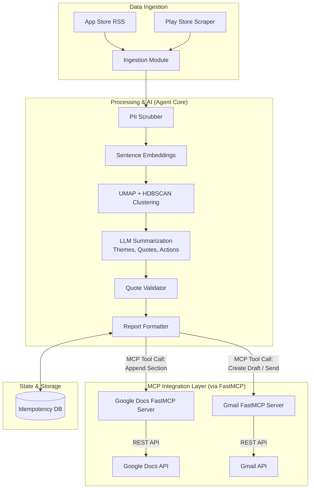
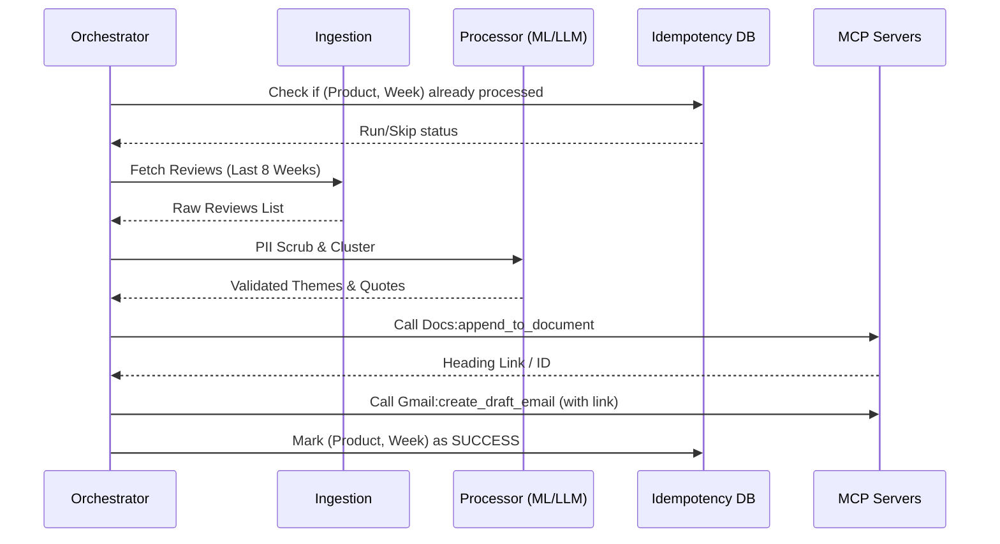

# Weekly Product Review Pulse — Detailed Architecture

## 1. System Overview
The Weekly Product Review Pulse automates the ingestion of app store reviews, uses machine learning (clustering and LLMs) to synthesize actionable themes, and leverages the **Model Context Protocol (MCP)** to securely deliver a one-page insight report via Google Docs and Gmail. 

The architecture strictly separates the reasoning/processing logic (the Agent) from the Google Workspace integrations (the MCP Servers), ensuring modularity, security, and idempotency.

## 2. High-Level Architecture Flow



## 3. Tech Stack & Dependencies

| Layer | Technology / Library | Purpose |
| :--- | :--- | :--- |
| **Runtime** | Python 3.10+ | Core execution environment |
| **Ingestion** | `google-play-scraper`, `feedparser` | Fetching reviews from stores |
| **Embeddings** | `sentence-transformers` (`all-MiniLM-L6-v2`) | Vector representation of text |
| **Clustering** | `umap-learn`, `hdbscan` | Dimensionality reduction & density clustering |
| **LLM** | GPT-4o or Gemini 1.5 Pro | Theme synthesis and summarization |
| **Data Validation**| `pydantic` | Strict schema enforcement for internal data |
| **Persistence** | `sqlite3` | Idempotency tracking and run logs |
| **MCP Framework** | `FastMCP` | Rapid creation of custom Google Docs/Gmail servers |
| **MCP Client** | `mcp-python-sdk` | Communication between Orchestrator and FastMCP servers |

## 4. Data Schemas (Pydantic Models)

### 4.1 Raw Review Object
```json
{
  "review_id": "string",
  "source": "app_store | play_store",
  "rating": "int (1-5)",
  "title": "string (optional)",
  "content": "string",
  "author": "string",
  "timestamp": "ISO-8601"
}
```

### 4.2 Synthesized Theme
```json
{
  "theme_name": "string (e.g., 'Login Latency')",
  "severity": "low | medium | high",
  "count": "int",
  "representative_quotes": ["string"],
  "action_items": ["string"]
}
```

## 5. Detailed Component Architecture

### 5.1 Data Ingestion Layer
*   **App Store (Apple)**: Fetches recent reviews using the iTunes Customer Reviews RSS feed (`https://itunes.apple.com/[country]/rss/customerreviews/...`).
*   **Google Play**: Scrapes reviews using `google-play-scraper`.
*   **Time Windowing**: Extracts reviews strictly within the configured window (e.g., last 8–12 weeks) based on review timestamps.

### 5.2 Processing & AI Layer
*   **PII Scrubbing**: Cleanses raw review text using Regex and NER (Named Entity Recognition) to remove phone numbers, email addresses, and specific names before any downstream processing.
*   **Clustering Pipeline**:
    1.  **Embed**: Convert reviews to 384-dimensional vectors.
    2.  **Reduce**: Use `UMAP` to reduce dimensions to 5-10 for better clustering performance.
    3.  **Cluster**: `HDBSCAN` groups reviews. Noise (unclustered reviews) is discarded.
*   **LLM Synthesis**: 
    *   **Prompting**: Uses a system prompt that mandates extraction of *exact* quotes.
    *   **Temperature**: Set to `0.1` to minimize creative hallucinations.
*   **Quote Validation**: A post-processing step that runs `if quote in original_review_text` check. If it fails, the quote is discarded.

### 5.3 Model Context Protocol (MCP) Integration Layer
The agent acts as an MCP Client. It connects to servers via Stdio or SSE.

#### 5.3.1 Google Docs MCP Server
*   **Tool: `append_to_document`**:
    *   **Input**: `document_id`, `content` (Markdown), `heading_text`.
    *   **Logic**: Uses Google Docs Batch Update API to append text and apply styling (Bold headings, Bullet points).
*   **Isolation**: The Agent never sees the Google OAuth tokens; the MCP server handles the `token.json` lifecycle.

#### 5.3.2 Gmail MCP Server
*   **Tool: `create_draft_email`**:
    *   **Input**: `to`, `subject`, `body_html`, `thread_id` (optional).
    *   **Logic**: Creates a draft in the user's Gmail "Drafts" folder for manual review.

## 6. Execution Sequence



## 7. State Management & Idempotency
The system uses a local SQLite database (`pulse_state.db`) with the following schema:

```sql
CREATE TABLE pulse_runs (
    id INTEGER PRIMARY KEY,
    product_id TEXT NOT NULL,
    iso_week TEXT NOT NULL,
    status TEXT CHECK(status IN ('STARTED', 'SUCCESS', 'FAILED')),
    doc_heading_id TEXT,
    gmail_draft_id TEXT,
    timestamp DATETIME DEFAULT CURRENT_TIMESTAMP,
    UNIQUE(product_id, iso_week)
);
```

## 9. Automation & CI/CD
The system is automated via **GitHub Actions** to ensure consistent weekly delivery without manual intervention.

### 9.1 Scheduler Configuration
*   **Trigger**: Every Monday at 03:00 UTC (08:30 IST).
*   **Workflow**: `.github/workflows/weekly_pulse.yml`
*   **Logic**:
    1.  Sets up Python 3.10 environment.
    2.  Restores Google Workspace tokens and API keys from GitHub Secrets.
    3.  Runs the orchestrator for the primary product (e.g., Groww).
    4.  Uploads local HTML/Markdown previews as build artifacts for auditing.

### 9.2 Required Secrets
To run the automation, the following secrets must be configured in the GitHub repository:
*   `GEMINI_API_KEY`: API key for LLM synthesis.
*   `CREDENTIALS_JSON`: Base64 encoded `credentials.json` from Google Cloud Console.
*   `TOKEN_JSON`: Base64 encoded `token.json` for Google Docs access.
*   `TOKEN_GMAIL_JSON`: Base64 encoded `token_gmail.json` for Gmail access.

> [!NOTE]
> To generate the Base64 strings for secrets, run: `cat filename.json | base64 -w 0` (Linux/macOS) or `[Convert]::ToBase64String([IO.File]::ReadAllBytes("filename.json"))` (PowerShell).

